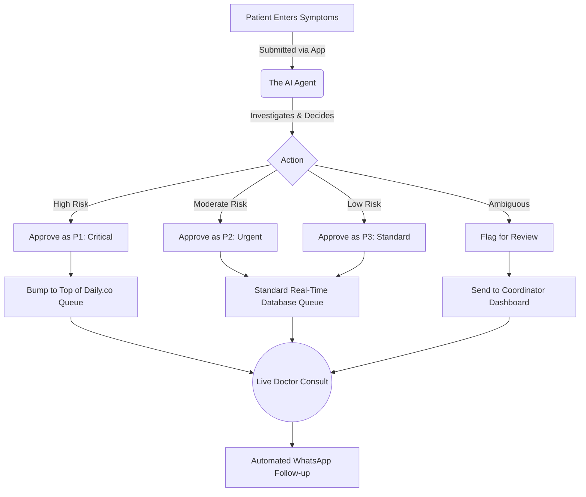

<div align="center">

# 🏥 ArogyaConnect: Teleconsultation System

**An automated, AI-driven triage and queue management environment acting as a Clinical Coordinator.**


</div>

---

> **❗️ EVALUATORS PLEASE NOTE ❗️**
> - **Deployment URL:** [YOUR_VERCEL_DEPLOYMENT_LINK_HERE]
> - **Public GitHub Repository:** https://github.com/DYUTIMAN03/Arogya_Connect

---

## 📖 Introduction: What is this Project?

Welcome to **ArogyaConnect**!

If you are new to automated healthcare platforms, think of this project as a high-speed, intelligent sorting facility for a clinic. Just like an emergency room triage nurse prioritizes critical injuries over minor scrapes to save lives, this system processes incoming rural patient symptoms without losing crucial time.

The underlying **Groq-powered LLM** plays the role of a **Clinical Triage Coordinator**. It sits at a virtual front desk, receives a stream of incoming patient symptoms via an app or kiosk, and has to decide what to do with each one. Should it flag the patient as Critical (P1)? Assign them to the standard queue (P3)? Or flag them for human review? This environment manages the incoming patients, grades the severity, and seamlessly updates a real-time queue for remote doctors to execute live teleconsultations.

---

## 🌟 Why Does This Matter?

At first glance, queue management might sound simple, but it is a life-or-death challenge globally, especially in rural India. Primary Health Centers (PHCs) are massively overwhelmed daily due to:

- **Lost Golden Hours:** Critical patients (e.g., snake bites, severe cardiac episodes) silently wait in the same queue as minor cold/flu patients, often resulting in tragic outcomes.
- **Severe Doctor Shortages:** A single centralized remote doctor often serves multiple villages. Sorting patients based on genuine need rather than "first-come-first-serve" maximizes their impact.
- **Follow-up Drop-off:** Patients leave without fully understanding prescriptions or return too late for post-consultation care.

This project deploys AI on a task that is genuine, high-stakes, and completely measurable. If an AI can master clinical triage, it can theoretically save countless lives and optimize medical resources in real-life isolated communities.

---

## 🧠 How It Works: The Big Picture

Here is a visual flow of how the patient interacts with our environment:



---

## ⚙️ The Interface (Action Space)
The coordinators and doctors don't just randomly guess. They act like real medical personnel and investigate using specific "tools":

- 🔍 **Live Queue:** See exactly which patients are currently sitting in the waiting room via Supabase Realtime.
- 📄 **Review Flags:** Read the AI's actual reasoning for assigning a specific priority to a patient before they enter a room.
- 📋 **Rx Pad:** Digital prescription engine that tracks symptoms and outputs directly to the cloud database.
- 🏢 **Daily.co Video:** Execute a 1-on-1 WebRTC video call instantly with the patient using an integrated Daily.co room.

After thoroughly investigating, the coordinator takes an action: `approve_priority`, `manual_override`, `escalate_case`, or `start_consult`.

---

## 📊 The Feedback (Observation & Triage)
Every time a patient submits symptoms, the AI Triage engine responds with:

- **Priority (P1-P4):** How severe is the issue? 
- **Confidence Score:** Did the AI confidently understand the symptoms? (If confidence drops below 70%, the case is auto-flagged for human review).
- **Reasoning Flag:** A one-sentence explanation on *why* the AI assigned the specific score.

---

## ⚙️ Step-by-Step Installation Guide (For Beginners)
Want to run this digital clinic on your own machine? Follow these simple steps. You don't need to be an expert to get it running!

### Step 1: System Requirements
Ensure you have the following installed on your computer:
- Node.js 18 or newer (Download [here](https://nodejs.org/))
- Git

### Step 2: Clone the Project
Open your terminal (or Command Prompt / PowerShell) and download the project files:
```bash
git clone https://github.com/DYUTIMAN03/Arogya_Connect.git
cd Arogya_Connect
```

### Step 3: Install Dependencies
Install the necessary package items to make the web app work:
```bash
npm install
```

### Step 4: Environment Variables
Create a `.env.local` file in the root folder and add your specific API keys:
```env
NEXT_PUBLIC_SUPABASE_URL=your_supabase_url
NEXT_PUBLIC_SUPABASE_ANON_KEY=your_supabase_anon_key
GROQ_API_KEY=your_groq_llama3_key
NEXT_PUBLIC_DAILY_API_KEY=your_daily_co_key
```

### Step 5: Start the Clinic
You can instantly start up the development environment:
```bash
npm run dev
```

---

## 🎮 The Priority Levels
The system triages patients into different brackets to ensure maximum efficiency. As the priority increases, the AI's response time and queuing bypass mechanisms get much more aggressive!

- 🟢 **P3: Standard (Low Severity)**
  - **Goal:** Wait in standard queue.
  - **Challenges:** Mild cold, seasonal allergies, minor headaches. 
  - **Action:** Processed linearly.

- 🟡 **P2: Urgent (Medium Severity)**
  - **Goal:** Needs attention soon.
  - **Challenges:** High fever for multiple days, minor physical injuries that require stitches, localized infections.
  - **Action:** Bumped securely above P3, flagged if waiting too long.

- 🔴 **P1: Critical (High Severity)**
  - **Goal:** Immediate intervention required.
  - **Challenges:** Severe chest pain (suspected myocardial infarction), symptoms of stroke, snake bites, massive trauma.
  - **Action:** Completely bypasses the local queue and alerts an available remote doctor instantly.

---

## 🏆 How is the AI Graded?
During testing, the LLM triage agent is monitored securely based on its clinical safety and logic. We heavily incentivize secure routing and penalize dangerous assumptions.

- **+1.00 🟢** Correctly categorizing a P3 patient without triggering unnecessary panic.
- **+0.05 🟢** Providing logical, step-by-step reasoning for a specific priority flag.
- **-0.50 🔴🔴** Plunging the patient into danger by categorizing a P1 emergency (like a snake bite) as a minor P3 issue.

---

## 🕵️ Example Coordinator Scenarios (Showcase)
Curious how this looks in practice? Here are actual traces of the application routing patients.

- **🟢 Scenario 1:** The 'Happy Path' (A patient with a mild fever sits linearly in the real-time queue).
- **🟡 Scenario 2:** Low AI Confidence (A patient uses confusing slang for an injury; AI drops confidence and flags the case strictly for Human Coordinator Review).
- **🔴 Scenario 3:** Override Action (Coordinator sees a deteriorating patient in the real-world waiting room and bumps them from P3 to P1 manually via the Dashboard UI).

---

## 💻 Interacting via Code
If you are a developer, here is a quick snippet showing how you can easily tap into our Supabase Realtime Live Queue logic:

```typescript
import { supabase } from '@/lib/supabase';

// Connect to the Live Clinic Queue Environment
const channel = supabase.channel('global_queue')
  .on(
    'postgres_changes',
    { event: 'INSERT', schema: 'public', table: 'queue_entries', filter: `clinic_id=eq.YOUR_CLINIC_ID` },
    (payload) => {
      console.log('🚨 New Patient Arrived in the Matrix!', payload.new);
      // Trigger UI updates or notification hooks here
    }
  )
  .subscribe();
```

Have fun managing your digital clinic and reaching maximum efficiency!


Built with ❤️ by Dyutiman Bharadwaj.
