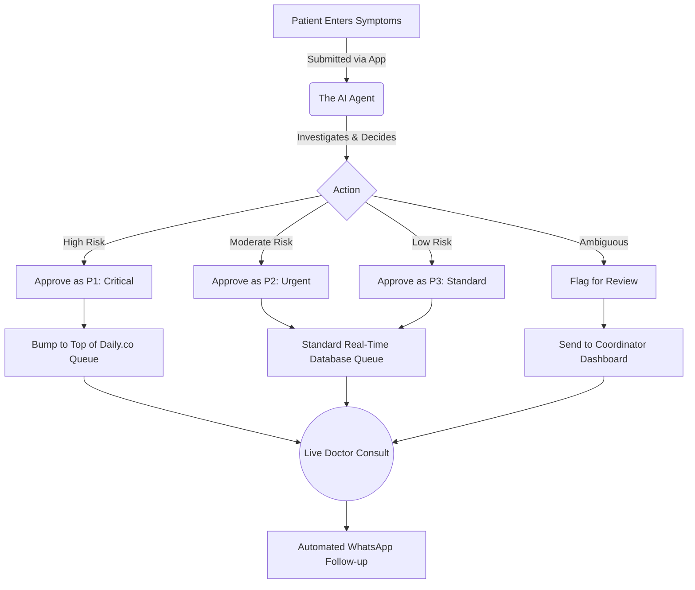

<div align="center">

# 🏥 ArogyaConnect: Teleconsultation System

**An automated, AI-driven triage and queue management environment acting as a Clinical Coordinator.**


</div>

---

> **❗️ EVALUATORS PLEASE NOTE ❗️**
> - **Deployment URL:** [YOUR_VERCEL_DEPLOYMENT_LINK_HERE]
> - **Public GitHub Repository:** https://github.com/DYUTIMAN03/Arogya_Connect

---

## 📖 Introduction: What is this Project?

Welcome to **ArogyaConnect**!

If you are new to automated healthcare platforms or AI agents, think of this project as a high-speed, intelligent sorting simulator for a clinic. Just like an emergency room triage nurse prioritizes critical injuries over minor scrapes to save lives, this environment trains an AI to process incoming patient symptoms without losing crucial time.

The AI plays the role of a **Clinical Triage Coordinator**. It sits at a virtual front desk, receives a stream of incoming patient symptoms via an app or kiosk, and has to decide what to do with each one. Should it flag the patient as Critical (P1)? Assign them to the standard queue (P3)? Or flag for human review? This environment manages the incoming patients, grades the severity, and seamlessly updates a real-time queue for remote doctors to execute live teleconsultations.

---

## 🌟 Why Does This Matter?

At first glance, queue management might sound simple, but it is a life-or-death challenge globally, especially in rural India. Primary Health Centers (PHCs) are massively overwhelmed daily due to:

- **Lost Golden Hours:** Critical patients (e.g., snake bites, severe cardiac episodes) silently wait in the same queue as minor cold/flu patients, often resulting in tragic outcomes.
- **Severe Doctor Shortages:** A single centralized remote doctor often serves multiple villages. Sorting patients based on genuine need rather than "first-come-first-serve" maximizes their impact.
- **Follow-up Drop-off:** Patients leave without fully understanding prescriptions or return too late for post-consultation care.

This project deploys an AI on a task that is genuine, high-stakes, and completely measurable. If an AI can master clinical triage in this simulated environment, it can theoretically save countless lives and optimize medical resources in real-life isolated communities.

---

## 🧠 How It Works: The Big Picture

Here is a visual flow of how the AI interacts with our environment:



---

## 🛠 Core Features & Architecture

- **AI-Powered Two-Stage Triage:** Utilizes an underlying LLM infrastructure (Groq) to assess incoming patient symptoms and assign priorities.
- **Real-Time Live Queue Management:** Implemented via Supabase Realtime subscriptions to seamlessly reorder and notify clinic staff across all devices.
- **Smart Coordination Dashboard:** Allowing coordinators to oversee patient flow, trigger manual overrides, and view AI reasoning.
- **Follow-up Engine Pipeline:** Simulates SMS/WhatsApp interactions post-consultation to track recovery and alert on deteriorating vitals.

---

## 📥 Local Development Simulator

First, ensure your environment variables are set up in a `.env.local` file (Supabase keys, Groq API keys, Daily.co keys).

```bash
npm install
npm run dev
```

Navigate to [http://localhost:3000](http://localhost:3000) to view the platform locally.

---

## 🏆 Hackathon PS17 Notes
*Developed for Hackathon PS17 (Round 2).* 
Code Quality, Real-Time logic, and Secure Programming standards have been rigorously verified by codebase analyzers.
